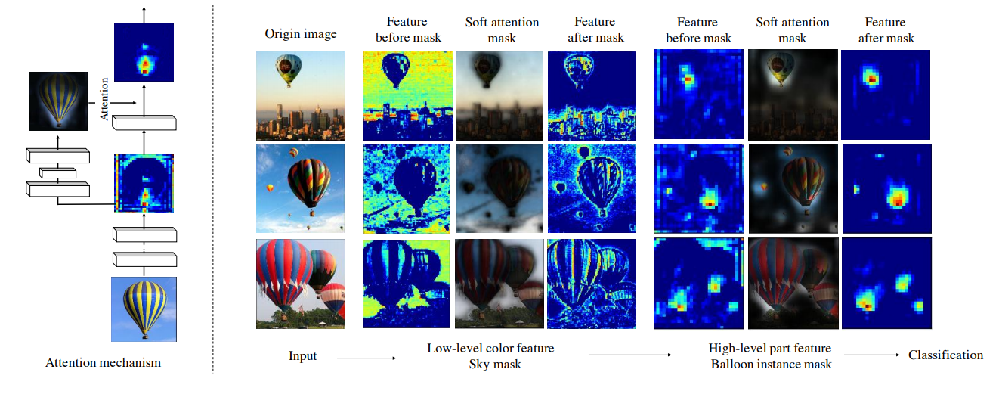
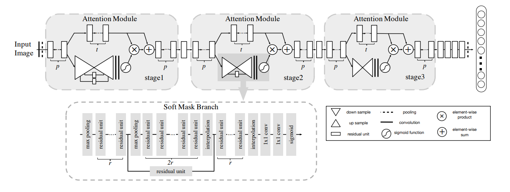
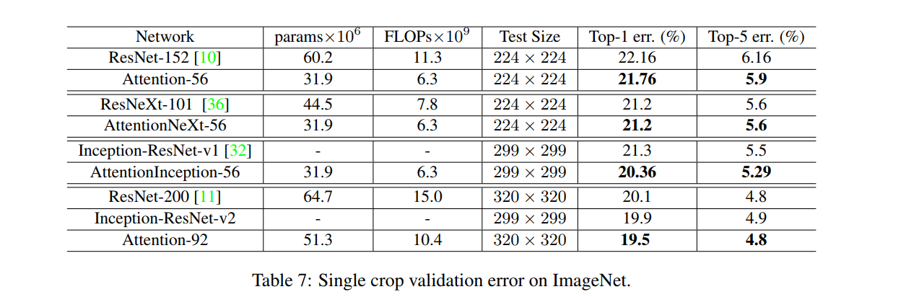

# Residual Attention Network 

A Gluon implement of Residual Attention Network

This code is refered to this project

https://github.com/tengshaofeng/ResidualAttentionNetwork-pytorch

## Prerequisites

Python3.6, Numpy, mxnet
- I use maxnet-cu90 --pre but if not is just ok
- If you want to train you need a recent NVIDIA GPU

## Results
- [x] cifar-10: Acc-95.41(**Top-1 err 4.59**) with Attention-92(higher than paper top-1 err 4.99)
- [x] cifar-10: Acc-95.68(**Top-1 err 4.32**) with Attention-92(use MSRAPrelu init)
- [ ] ImageNet: hard to train but network probably right.(looking forward to you pull request)


## How to train & test
For training cifar10, just run train_cifar.py

For only testing cifar10, you can simply run below script.
```python
import mxnet as mx
from mxnet import gluon, image
from train_cifar import test
from model.residual_attention_network import ResidualAttentionModel_92_32input_update

def trans_test(data, label):
    im = data.astype(np.float32) / 255.
    auglist = image.CreateAugmenter(data_shape=(3, 32, 32),
                                    mean=mx.nd.array([0.485, 0.456, 0.406]),
                                    std=mx.nd.array([0.229, 0.224, 0.225]))
    for aug in auglist:
        im = aug(im)

    im = nd.transpose(im, (2, 0, 1))
    return im, label

ctx = mx.gpu()
val_data = gluon.data.DataLoader(
    gluon.data.vision.CIFAR10(train=False, transform=trans_test),
    batch_size=64)

net = ResidualAttentionModel_92_32input_update()
net.hybridize()
net.load_parameters('cifar_param/test_iter225999_0.95410.param')
test(net, ctx, val_data, 0)
```

## Paper referenced
Residual Attention Network for Image Classification (CVPR-2017 Spotlight) By Fei Wang, Mengqing Jiang, Chen Qian, Shuo Yang, Chen Li, Honggang Zhang, Xiaogang Wang, Xiaoou Tang(https://arxiv.org/pdf/1704.06904.pdf)


**Left**: an example shows the interaction between features and attention masks. **Right**: example images illustrating that different features have different corresponding attention masks in our network. The sky mask diminishes low-level background blue color features. The balloon instance mask highlights high-level balloon bottom part features.
</br>


Attention Network architecture.
</br>



The Attention-56 network outperforms ResNet-152 by a large margin with a 0.4% reduction on top-1 error and a 0.26% reduction on top-5 error. More importantly **Attention-56 network achieves better performance with only 52% parameters and 56% FLOPs compared with ResNet-152**, which suggests that the proposed attention mechanism can significantly improve network performance while reducing the model complexity.

